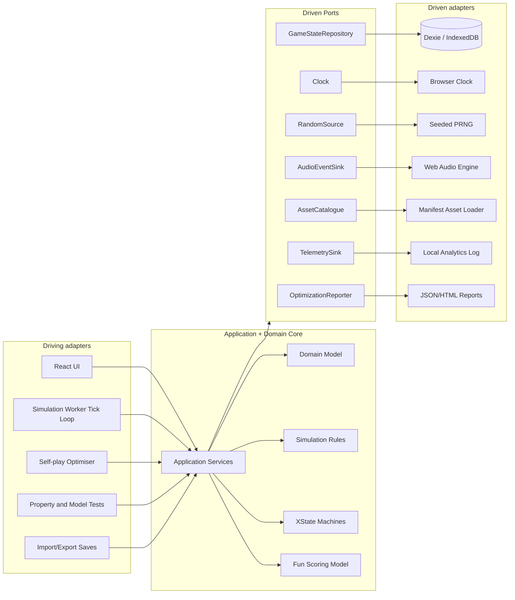
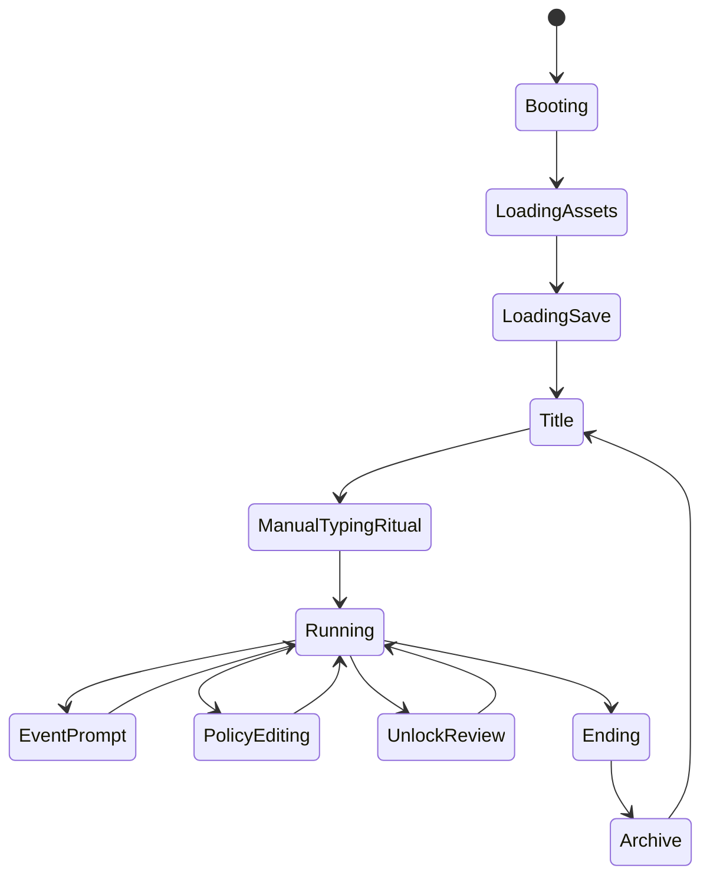
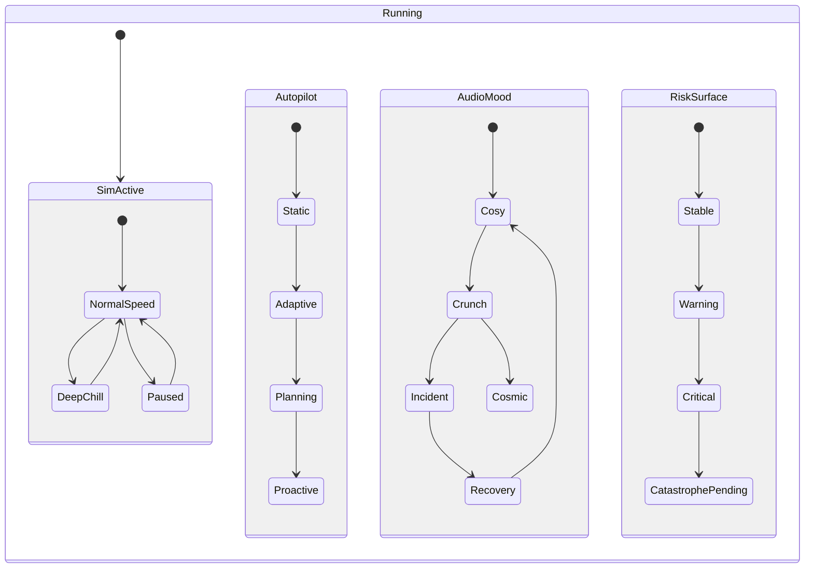

# Vibe Coder HLD v0.1

**Product thesis:** Vibe Coder is a local-first, policy-driven idle strategy game where the player does not grind clicks. They express intent, watch an increasingly autonomous software civilization interpret that intent, then intervene when the system's consequences become interesting, alarming, or weirdly beautiful. The core fantasy is not "number go up"; it is "the player's policies became a civilization, and now the question is whether it deserves more watts."

The biggest design warning: “idle” must not mean “low-interactivity”. Crawford's framing provides the north star here: interaction is a conversation in which the system must listen to what the player says, think about it meaningfully, and speak back clearly; slow strategy can still be highly interactive when the player has a rich vocabulary of meaningful choices and the game responds with deep consequences.  Crawford also argues that reducing interactivity often makes a game less fun faster than it makes it easier, so Vibe Coder should remove repetitive labour while preserving agency, legibility, and consequence. 

---

# WHY: vision and purpose

## What problem does Vibe Coder solve, and for whom?

Vibe Coder solves a very specific itch: many idle games offer automation fantasy, but most collapse into either click-farming, spreadsheet worship, or opaque exponential soup. Vibe Coder instead offers a systems-design fantasy for players who enjoy software, organisational dynamics, ethical trade-offs, emergent simulation, and absurd escalation from “one tired goblin at a CRT” to “thermodynamic governance at stellar scale”.

Target players include:

| Persona              | What they want                                                          | What Vibe Coder gives them                                                     |
| -------------------- | ----------------------------------------------------------------------- | ------------------------------------------------------------------------------ |
| Systems tinkerer     | Coupled variables, visible feedback loops, optimisation without twitch  | Policies, budgets, telemetry, regime shifts                                    |
| Software gremlin     | Satirical recognition of tech debt, CVEs, OSS, agents, startup nonsense | A simulation that treats code, debt, brand, trust, and power as linked systems |
| Idle-game enjoyer    | Progress while away, low pressure, satisfying unlocks                   | Offline progress, policy automation, ambient simulation                        |
| Narrative strategist | Consequences, end states, ethical choices                               | Karma, alignment, politics, collapse, utopia, Skynet, Borg, OSS-on-UBI         |
| Aesthetic wanderer   | A living toy world, music, mood, clever detail                          | 90s Amiga/PC-inspired visual theatre with reactive sound                       |

## What does the application do?

It runs a deterministic-ish, local-first idle simulation in a React PWA. The player starts with a short manual typing ritual, then controls allocation and ethics policies. Every tick, the system updates code generation, tech debt, revenue, open source output, karma, brand, power consumption, PMF, customer income, incidents, progression unlocks, autonomy risk, and eventually civilization-scale thermodynamic constraints.

The game’s “conversation” loop is:

**Player says:** “Ship 35%, OSS 15%, quality 20%, never hide CVEs, cap fossil energy.”
**Simulation thinks:** Calculates throughput, debt, demand, incidents, alignment drift, power draw, macro economy, event triggers.
**Simulation speaks:** Shows commit streams, debt constellations, incidents, brand aura, music modulation, visual environmental growth, and decision prompts.

## Why will players use it instead of alternatives?

The unique value proposition is a strange little chimera: an idle game with the ethics of a civic sim, the system coupling of an engineering sandbox, and the visual texture of a lost Amiga design bible. Its differentiators:

* **No click farming:** interaction centres on policies and constraints, not repeated low-value actions.
* **Ethics as mechanics:** karma and alignment affect autonomy risk, brand, OSS contribution, and available strategies.
* **Tech debt as a vector:** different debt categories create different failure modes, rather than one generic “badness” number.
* **Power becomes the economy:** the game’s late stage changes regime from money to watts to heat.
* **Adversarial tuning:** self-play agents hunt for boring optima, lock-on-victory strategies, and exploit paths.
* **Local-first trust:** the MVP stores progress locally and works offline.

The attached PWA guidance supports this local-first stance: the Wildside design says the UI should render from local state first, treat the network as optional, and make synchronisation explicit rather than magical.  For Vibe Coder's MVP, the project can go further: no network dependency at all, with future sync treated as a new adapter rather than a foundational assumption.

---

# WHAT: core requirements

## Core product requirements

System must run an offline-capable React PWA with local Dexie persistence.

System must model game state as a deterministic simulation state plus event log, not as scattered UI state.

System must expose player agency through policy allocation, ethics constraints, unlock decisions, and event responses.

System must support at least three simulation speeds: normal, deep chill, and catch-up/offline progress.

System must model resources: LoC, cash, tech debt vector, karma, brand, power, PMF, customer income, alignment, and stage progression.

System must model tech debt categories independently: cyclomatic complexity, CQRS violations, config drift, XSS, SQL injection, shell injection, CSRF, and CVEs.

System must show consequences clearly: debt constellations, commit stream, incident timeline, brand aura, power draw, macro income, alignment drift, and progression gates.

System must support XState state graphs for app lifecycle, save/load, run lifecycle, policy editing, event resolution, progression, and audio mood.

System must keep domain logic independent from React, Dexie, browser APIs, Web Audio, image assets, and analytics. That follows ports-and-adapters practice: external actors interact through ports, while adapters translate between technologies and the application core. 

System must provide a game-parameter optimisation harness using adversarial self-play and explicit “fun” metrics.

System must keep generated art and generated music assets out of gameplay-critical truth. The Skyjoust and Agentland documents both repeat this useful principle: generated imagery can establish source references and production inputs, but live gameplay text, counters, state labels, and authoritative values belong to the renderer/runtime. 

## Key workflows

| Workflow             | Trigger                       | Key steps                                                            | Success                                           |
| -------------------- | ----------------------------- | -------------------------------------------------------------------- | ------------------------------------------------- |
| First run            | New PWA install/open          | intro, typing ritual, initial ethos choice, first policy             | player sees the sim run without repeated clicking |
| Policy rebalance     | Player notices drift or event | inspect systems, adjust allocations, edit constraints, commit policy | consequences change within readable time          |
| Incident response    | Security/debt/alignment event | choose disclosure, mitigation, ignore, cover-up, civic response      | event affects karma, brand, debt, PMF, cash       |
| Progression unlock   | Threshold reached             | review unlock risks, accept/defer, update simulation stage           | new regime changes available strategies           |
| Offline return       | App resumes                   | compute bounded catch-up, summarise changes, surface major events    | player understands what happened while away       |
| End-state resolution | Threshold crossed             | determine ending, play final scene, allow archive/new run            | ending feels earned, not random                   |
| Self-play tuning     | Developer tool/CI             | run agents, score fun, detect exploits, emit parameter report        | designers receive actionable balancing deltas     |
| Asset authoring      | Dev workflow                  | create prompt, generate source, validate, process, manifest          | runtime loads only approved processed assets      |

## Expected outcomes

For players: a compact, surprising, emotionally literate idle strategy toy that rewards long-term thinking over finger-drumming.

For development: a testable local-first codebase with clean domain seams, deterministic replay capacity, and a creative pipeline that can produce rich assets without letting generated artefacts become brittle runtime authority.

For design: measurable fun proxies that detect degenerate strategies before the player finds them and names them something unprintable.

---

# HOW: planning and implementation

## Target stack

| Layer       | Recommendation                                            | Notes                                                                                                                   |
| ----------- | --------------------------------------------------------- | ----------------------------------------------------------------------------------------------------------------------- |
| Runtime     | React 19 + TypeScript + Vite/Bun                          | Mirrors the v2a stack direction, using React, Vite, TypeScript, token generation, Vitest, and modern frontend tooling.  |
| State graph | XState                                                    | App lifecycle, game run, policy editing, event prompts, progression, audio mood                                         |
| Storage     | Dexie over IndexedDB                                      | Local saves, event log, parameter packs, run archive, settings, asset manifests                                         |
| Rendering   | React UI + Canvas/OffscreenCanvas world visualizer        | DOM for accessible controls, Canvas for animated city-aquarium                                                          |
| Audio       | Web Audio API + worklet-ready scheduler                   | State-driven music layers, procedural motifs, SFX event bus                                                             |
| Styling     | Design tokens + CSS variables + Tailwind/DaisyUI optional | Tokenise palette, spacing, typography, state colours                                                                    |
| Testing     | Vitest, fast-check, Playwright, axe                       | Unit, property, simulation, accessibility, browser flows                                                                |
| Build/PWA   | Vite PWA plugin or custom service worker                  | App shell precache, local asset caching, offline boot                                                                   |

The v2a stack documents describe a broader architecture with Dexie for durable browser-side storage, XState for explicit orchestration, and Zustand/TanStack Query for other state classes. Vibe Coder’s offline-only MVP can skip server-state complexity initially, then add TanStack Query only when a cloud sync or content service arrives. 

## Architectural style: hexagonal core with browser adapters

Hexagonal architecture fits this unusually well because the sim wants to survive technology swaps. React, Dexie, Web Audio, Canvas, imagegen outputs, telemetry, and future cloud sync should orbit the game domain rather than invade it wearing muddy boots.

The domain/application core contains entities, value objects, pure simulation functions, policy services, progression rules, event rules, and balancing metadata. Inbound adapters drive it. Outbound adapters implement storage, clocks, random sources, audio, visualisation, and telemetry. Hexagonal guidance from the attached architecture notes distinguishes driving actors, which initiate interaction, from driven actors, which the application calls through ports; it also places port interfaces inside the core while adapter implementations live outside. 

### Proposed architecture diagram



## Module layout

A concrete TypeScript layout could look like this:

```text
src/
  app/
    main.tsx
    providers/
      xstate-provider.tsx
      dexie-provider.tsx
      audio-provider.tsx
      settings-provider.tsx
    routes/
      title/
      run/
      lab/
      archive/
      settings/
    shell/
      app-shell.tsx
      command-palette.tsx
      skip-link.tsx

  domain/
    model/
      resources.ts
      policy.ts
      tech-debt.ts
      alignment.ts
      events.ts
      progression.ts
      endings.ts
      run-state.ts
    services/
      start-run.ts
      apply-policy.ts
      simulate-tick.ts
      resolve-event.ts
      unlock-stage.ts
      compute-ending.ts
    rules/
      throughput.ts
      debt.ts
      revenue.ts
      open-source.ts
      karma-alignment.ts
      power.ts
      macro-economy.ts
      incidents.ts
    ports/
      game-state-repository.ts
      random-source.ts
      clock.ts
      audio-event-sink.ts
      asset-catalogue.ts
      telemetry-sink.ts

  application/
    machines/
      app.machine.ts
      run.machine.ts
      policy.machine.ts
      event.machine.ts
      progression.machine.ts
      audio.machine.ts
    commands/
      command.ts
      command-bus.ts
    selectors/
      dashboard-selectors.ts
      risk-selectors.ts
      chart-selectors.ts

  adapters/
    persistence/
      dexie-db.ts
      dexie-game-state-repository.ts
      migrations.ts
    rng/
      mulberry32.ts
      xoshiro.ts
    audio/
      web-audio-engine.ts
      music-director.ts
      sound-event-map.ts
    render/
      canvas-world.ts
      debt-constellation.ts
      city-aquarium.ts
      heat-visualizer.ts
    assets/
      manifest-loader.ts
      atlas-loader.ts

  optimisation/
    agents/
      exploiter.agent.ts
      ethical-steward.agent.ts
      speedrunner.agent.ts
      collapse-goblin.agent.ts
    scoring/
      fun-score.ts
      exploit-score.ts
      pacing-score.ts
    runner/
      self-play-runner.ts
      parameter-sweep.ts
      report.ts

  data/
    fixtures/
      parameter-packs/
      content-packs/
    registries/
      stage-registry.ts
      event-registry.ts
      descriptor-registry.ts
```

This layout borrows Wildside’s feature-first discipline, but keeps a stronger game-domain core so React does not become the place where equations go to die. Wildside’s design recommends narrow shared primitives and feature modules rather than letting “shared” become a drawer full of ghost cables. 

---

# Domain model

## Core aggregates

### `RunState`

One complete playable run.

```ts
type RunState = {
  id: RunId;
  seed: Seed;
  createdAt: IsoTimestamp;
  lastSimulatedAt: IsoTimestamp;
  tick: TickIndex;
  stage: StageId;
  resources: Resources;
  policy: AllocationPolicy;
  ethics: EthicsPolicy;
  techDebt: TechDebtVector;
  quality: QualityCoverageVector;
  alignment: AlignmentState;
  macro: MacroState;
  progression: ProgressionState;
  pendingEvents: readonly GameEvent[];
  resolvedEvents: readonly EventResolution[];
  unlocks: UnlockLedger;
  ending?: EndingState;
};
```

### `Resources`

```ts
type Resources = {
  loc: Decimalish;
  valueLoc: Decimalish;
  cashPounds: Decimalish;
  karma: number;
  brand: number;
  powerWatts: Decimalish;
  pmf: number;
  humanCustomerIncome: Decimalish;
  robotCustomerIncome: Decimalish;
};
```

### `TechDebtVector`

```ts
type TechDebtVector = {
  cyclomaticComplexity: number;
  cqrsViolations: number;
  configDrift: number;
  xss: number;
  sqlInjection: number;
  shellInjection: number;
  csrf: number;
  cves: number;
};
```

### `AllocationPolicy`

Percentages must sum to 100. The UI can display sliders, but the domain accepts a validated value object.

```ts
type AllocationPolicy = {
  ship: Percent;
  openSource: Percent;
  quality: Percent;
  security: Percent;
  researchUx: Percent;
  marketingSales: Percent;
  civicAction: Percent;
  powerInfra: Percent;
};
```

### `EthicsPolicy`

Ethics constraints should act as commitments, not flavour toggles.

```ts
type EthicsPolicy = {
  darkPatterns: "forbid" | "allow";
  fossilEnergyCapPercent: number;
  cveDisclosureDays: number;
  trainingPiracy: "forbid" | "allow";
  labourPolicy: "human-centred" | "automation-first" | "extractive";
  politicalInfluence: "civic" | "backroom" | "none";
};
```

## Simulation tick contract

A tick should remain pure relative to its inputs. The application service can orchestrate ports, but the simulation function should be testable without React, Dexie, audio, or time.

```ts
type SimTickInput = {
  run: RunState;
  dtSeconds: number;
  rng: RandomSourceSnapshot;
  parameterPack: ParameterPack;
};

type SimTickOutput = {
  run: RunState;
  emittedEvents: readonly DomainEvent[];
  audioEvents: readonly AudioEvent[];
  visualSignals: readonly VisualSignal[];
  telemetry: readonly TelemetryEvent[];
};
```

Skyjoust’s technical design provides a useful analogue: simulation ticks should not read wall-clock time, and rendering can interpolate visuals but must not feed back into authoritative simulation state. 

---

# XState state graph

Use XState for **explicit lifecycle and workflow state**, not for every numerical simulation variable. The simulation is a reducer-ish domain service. XState orchestrates when commands may run, what UI mode the player inhabits, and how events resolve.

## Top-level machines



Parallel regions inside `Running`:



Skyjoust uses explicit state resources for app runtime, lifecycle, events, scoring, rewards, and other regions, and treats the state graph as an authoritative contract that runtime systems can refine but must not violate. Vibe Coder should adopt the same pattern, using XState rather than Stateright for the browser MVP, then adding model tests around the machines. 

## Machine responsibilities

| Machine                   | Owns                                             | Must not own             |
| ------------------------- | ------------------------------------------------ | ------------------------ |
| `app.machine`             | boot, asset loading, save loading, route mode    | sim equations            |
| `run.machine`             | run lifecycle, speed, paused/running, ending     | resource math            |
| `policy.machine`          | draft policy, validation, commit/cancel          | persistence              |
| `event.machine`           | incident prompt, available responses, resolution | random event generation  |
| `progression.machine`     | unlock review, accept/defer, stage transition    | asset rendering          |
| `audio.machine`           | mood state, intensity, stems enabled             | game rules               |
| `asset-authoring.machine` | dev-only prompt request/import states            | runtime image generation |

---

# Persistence and Dexie

## Storage principles

The MVP is offline-only. Dexie should own local durability, but not gameplay semantics. The Wildside model explicitly treats Dexie as durable storage for heavier assets and outbox-like records, not as a synchronisation worldview; Vibe Coder can use the same philosophy for saves, event logs, content packs, and optimisation reports. 

## Dexie schema

```ts
db.version(1).stores({
  runs: "id, createdAt, updatedAt, stage, ending.kind",
  runSnapshots: "[runId+tick], runId, tick, createdAt",
  runEvents: "[runId+tick+sequence], runId, tick, type",
  settings: "key",
  parameterPacks: "id, version, createdAt, status",
  contentPacks: "id, version, createdAt, status",
  assetManifests: "id, family, status, bucket",
  selfPlayReports: "id, parameterPackId, createdAt, score",
  audioPresets: "id, version",
});
```

## Save strategy

Use periodic snapshots plus an append-only event log. That gives three useful properties: fast load, reproducible debugging, and a future path to cloud sync.

* Snapshot every N ticks or every M seconds of active simulation.
* Log policy commits, unlock decisions, event resolutions, random seeds, parameter pack hash, and major domain events.
* On load, restore latest snapshot and replay subsequent events.
* On offline return, apply bounded catch-up and summarise skipped time rather than dumping 10,000 tiny incidents into the player’s lap.

Skyjoust’s persistence and replay section stores schema version, seed, active modifiers, currencies, unlocks, penalties, configuration hash, asset manifest hash, and per-tick inputs; Vibe Coder should keep the same spirit with run seed, parameter pack hash, asset manifest hash, policy/event log, and replayable state actions. 

---

# Rendering and interface

## UI architecture

Use React for accessible controls and layout. Use Canvas for the living simulation viewport. Keep the actual gameplay values in domain selectors, not in canvas internals.

Core screens:

| Interface            | Purpose                             | Critical components                                                         |
| -------------------- | ----------------------------------- | --------------------------------------------------------------------------- |
| Title / New Run      | Start, load, archive                | run list, new seed, settings                                                |
| Manual Typing Ritual | Establish initial codebase genetics | typing field, ethos toggle, seed summary                                    |
| Main Dashboard       | Primary game loop                   | resource top bar, city viewport, policy panel, ethics panel, event timeline |
| Debt Constellation   | Diagnose risk                       | tech debt vector map, dependency clusters, incident probabilities           |
| Power & Heat         | Late-game economy                   | power draw, generation mix, waste heat budget                               |
| Progression Tree     | Unlocks and regime shifts           | stage nodes, gates, risk warnings                                           |
| Incident Prompt      | Meaningful event decisions          | cause, options, consequences, uncertainty                                   |
| Optimization Lab     | Dev-only self-play                  | parameter packs, agent results, exploit reports                             |
| Archive / Endings    | Run history                         | ending cards, score, replay summary                                         |

The visual design docs emphasize that generated art can guide focal order and layer grammar, but runtime owns layout, text, panels, charts, status semantics, hit areas, lighting, and animation timing.  That maps cleanly to Vibe Coder: the dashboard can look painterly and lush, but the player must never need to read generated micro-text to understand a CVE incident.

## Visual layer order

Adapt the Agentland layer grammar to Vibe Coder:

1. Background atmosphere: rainy city, dusk, orbital glow, heat haze.
2. Environment layers: bedsit, café, warehouse, robot office, data centre, orbital compute.
3. System actors: coder, goblin, bots, agents, BCI figure, Kardashev infrastructure.
4. Flow overlays: commit streams, power flows, trust aura, debt constellations.
5. UI panels: top resources, policy sliders, ethics toggles, autopilot.
6. Runtime text: all numbers, labels, warnings, tooltips.
7. Lighting and audio-reactive flourishes.
8. Debug overlays: hit boxes, state graph node, tick time, event queue.

The attached art bible says runtime lighting masks should remain deterministic, with generated environment art guiding placement but scripts or code controlling lamp pools, screen glow, vignette, and active pulses. 

---

# Simulation design

## The system heartbeat

A fixed simulation tick of 1 in-game second is enough for the idle feel. Presentation can animate at the browser’s frame rate, but the sim should step in fixed chunks. Offline catch-up can aggregate steps using coarse analytical approximations once the run enters stable regions.

Proposed tick order:

1. Validate current policies.
2. Calculate power availability and throttling.
3. Calculate alignment multiplier.
4. Calculate LoC throughput.
5. Split output by allocation policy.
6. Generate and reduce tech debt.
7. Calculate shippable value.
8. Update revenue, OSS, karma, brand, PMF.
9. Update macro economy and customer segments.
10. Roll event hazards from current risk state.
11. Apply autopilot adjustments if enabled.
12. Evaluate progression gates and ending thresholds.
13. Emit domain, visual, telemetry, and audio events.
14. Persist periodically.

## Parameter packs

A `ParameterPack` should contain every tunable constant:

```ts
type ParameterPack = {
  id: string;
  version: string;
  resources: ResourceParameters;
  stage: StageParameters;
  debt: DebtParameters;
  incidents: IncidentParameters;
  alignment: AlignmentParameters;
  market: MarketParameters;
  power: PowerParameters;
  macro: MacroParameters;
  endings: EndingParameters;
  funWeights: FunWeights;
};
```

Parameter packs make self-play, balancing, player-visible difficulty variants, and reproducibility easier. They also prevent “tiny constants smeared across files” syndrome, which is a recognised cousin of config drift goblinry.

---

# Defining “fun” for adversarial self-play

## Design interpretation of Crawford

Crawford gives three practical constraints.

First, the point is the challenge, not merely achieving the formal goal. A player who finds a loophole can technically win while evading the intended challenge, so the design must eliminate lock-on-victory strategies and loopholes that bypass the real game. 

Second, conflict gives challenge life. In Vibe Coder, the opponent is not another player; it is a living bundle of active pressures: debt, market drift, misalignment, macro income collapse, power shortage, reputational dynamics, and heat. Conflict can be indirect and systemic rather than violent, which suits a long idle game. 

Third, process intensity matters. Vibe Coder should not just display huge tables of lore and static content; it should compute surprising consequences from compact rules. Crawford’s “crunch per bit” idea is perfect for a systems idle game: data can add texture, but process must carry the fun. 

## Fun score

The optimisation harness should not optimise for “biggest number” or “longest session”. That would summon the metrics demon and give it a lanyard.

Use a composite score:

```ts
FunScore =
  + meaningfulChoiceScore
  + consequenceLegibilityScore
  + recoveryDramaScore
  + regimeShiftScore
  + strategicDiversityScore
  + narrativeSurpriseScore
  + ethicalTensionScore
  + pacingScore
  - exploitabilityScore
  - opacityScore
  - deadTimeScore
  - irreversibleNonsenseScore
  - dominantStrategyScore
  - clickPressureScore
```

### Metrics

| Metric                 | Meaning                                                  | How to estimate                                      |
| ---------------------- | -------------------------------------------------------- | ---------------------------------------------------- |
| Meaningful choice      | Different policies produce different viable futures      | policy outcome variance over multiple seeds          |
| Consequence legibility | Player can understand why things happened                | event cause trace length, UI explainability coverage |
| Recovery drama         | Bad events hurt but do not always end the run            | incident recovery probability and time               |
| Strategic diversity    | Multiple policy archetypes can reach interesting endings | self-play archetype success distribution             |
| Regime shift           | Unlocks change the shape of decisions                    | delta in optimal policy before/after stage           |
| Ethical tension        | Ethics sometimes costs throughput but buys survival      | trade-off curve between karma and growth             |
| Exploitability         | One strategy bypasses challenge                          | best-agent score gap and low-risk runaway detection  |
| Dead time              | Nothing meaningful changes                               | time between decision-worthy events                  |
| Opacity                | Important state changes lack explanation                 | unexplained delta count                              |
| Dominant strategy      | One allocation dominates across seeds                    | Pareto frontier collapse                             |
| Click pressure         | Player benefits from repeated manual actions             | manual-action advantage after post-ritual phase      |

## Self-play agents

| Agent               | Purpose                                            |
| ------------------- | -------------------------------------------------- |
| Growth goblin       | Maximise LoC, cash, and stage unlocks              |
| Debt janitor        | Minimise debt, maximise reliability                |
| Ethical steward     | Maintain karma and alignment                       |
| Backroom baron      | Use dark patterns, influence, and fossil shortcuts |
| OSS saint           | Maximise open source, community, brand             |
| Heat death gremlin  | Chase compute until waste heat breaks everything   |
| Exploit hunter      | Search for degenerate loops and lock-on-victory    |
| Casual player model | Make sparse, plausible policy updates              |

The exploit hunter matters most. It should try to prove that the challenge can be bypassed: for example, a policy that opens OSS just enough to farm brand while hiding CVEs, or a power build that disables quality checks without visible punishment.

## Optimization process

1. Generate candidate parameter packs.
2. Run self-play agents over many seeds.
3. Score runs with FunScore and exploit diagnostics.
4. Reject parameter packs with lock-on-victory strategies.
5. Surface Pareto candidates to designers.
6. Run human playtests on the best candidates.
7. Promote a parameter pack with a manifest and changelog.

This keeps the computer as a design assistant, not a final arbiter. The machine can find cursed local maxima; the designer still decides whether the curse is entertaining.

---

# Creative workflow for art and image generation

## Principle

Use image generation as an art-direction accelerator and source-art generator, not as an authority for runtime logic.

The attached asset specification defines three buckets that transfer cleanly to Vibe Coder: reference-only generated outputs, generated sources converted into deterministic runtime assets, and algorithmic assets owned by scripts or code.  Runtime assets should graduate only after prompt provenance, source files, post-processing settings, palette/alpha/slice checks, runtime text safety, processed paths, atlas metadata, and consumer IDs exist. 

## Vibe Coder asset taxonomy

| Bucket                     | Vibe Coder examples                                                                       | Runtime role            |
| -------------------------- | ----------------------------------------------------------------------------------------- | ----------------------- |
| Reference-only             | design bible pages, moodboards, environment sheets, ending cards                          | not loaded into runtime |
| Generated-source-converted | coder sprites, bot sprites, props, skyline layers, data-centre cutouts, ending thumbnails | processed and validated |
| Algorithmic                | UI panels, charts, text, debt constellations, power graphs, light masks, particle systems | runtime truth           |

## Required art pipeline

```text
prompts/
  generated/
    style-book/
    characters/
    environments/
    endings/
    props/
    ui-ornaments/
assets/
  source/gpt-images-2/
  processed/
  atlases/
  manifests/
  palette/
  validation/
tools/
  remove_chroma_and_validate.py
  quantize.py
  slice_sheet.py
  pack_atlas.py
  build_lightmask.py
  check_assets.py
```

The Agentland workflow already recommends development-time roles such as art director, prompt designer, asset integrator, runtime implementer, and QA reviewer; Vibe Coder should reuse that division because the work really does split into style judgement, prompt craft, deterministic processing, implementation, and validation. 

---

# Reactive music and sound design

## Audio principle

The simulation emits semantic audio events. The audio engine consumes them. Audio never mutates authoritative game state.

Skyjoust’s audio design gives a clean precedent: simulation emits audio events, presentation consumes them, the audio layer owns buses, rate limits, spatial panning, and state-driven music layers, and playback never mutates authoritative match state. 

## Browser implementation

Use Web Audio API with an `AudioDirector` adapter implementing `AudioEventSink`.

```ts
type AudioEvent =
  | { type: "commit"; amount: number; source: "agent" | "human" | "oss" }
  | { type: "incident"; severity: number; category: DebtCategory }
  | { type: "policyCommitted"; delta: PolicyDeltaSummary }
  | { type: "alignmentWarning"; drift: number }
  | { type: "stageUnlocked"; stage: StageId }
  | { type: "powerShortage"; wattsMissing: number }
  | { type: "endingTriggered"; ending: EndingKind };
```

## Music system

Use layered generative music rather than long static loops:

| Layer            | Driven by                | Sound idea                                               |
| ---------------- | ------------------------ | -------------------------------------------------------- |
| Human/cosy layer | early stage, high karma  | warm pads, muted keys, rain, café clatter                |
| Startup pulse    | throughput and shipping  | arpeggiated synths, soft percussion                      |
| Debt dissonance  | tech debt vector         | detuned partials, glitch ticks, unstable delay           |
| OSS choir        | open source and brand    | airy chords, community motifs                            |
| Alignment shadow | drift and autonomy       | low drones, spectral filtering                           |
| Power grid       | watts and infrastructure | sub pulses, turbine rhythms, electrical hum              |
| Cosmic heat      | Dyson/Matrioshka stage   | slow harmonic expansion, radiator noise, stellar shimmer |

Use deterministic seeds for generated motifs per run, so the player's civilization gets its own musical identity. The same seed should not produce identical sound every second, but it should produce a stable motif family.

## SFX design

* Code commits: tiny tactile blips, grouped and rate-limited.
* Debt accumulation: faint knotting/glitch texture.
* Debt cleanup: softened de-tangle shimmer.
* CVE incident: sharp alert, but no casino siren nonsense.
* Policy commit: mechanical switch plus paper stamp.
* Stage unlock: short motif that reflects the new regime.
* Catastrophe: audio ducking, distinct sting, then altered ambience.
* Degrowth utopia / UBI ending: quieter, less dense mix, a sonic exhale.

---

# Business requirements and rules

## Non-negotiable business rules

1. The game must not require network access for MVP play.
2. The game must not monetize through dark patterns, forced clicking, or ad pressure.
3. Manual typing must remain an opening ritual only, not a competitive ongoing action.
4. Policies must sum to 100 and invalid policies must never enter the domain core.
5. Ethics commitments may be broken only through explicit player choice or event consequence, never silently.
6. Runtime-critical numbers, labels, warnings, and controls must come from deterministic UI rendering, not generated images.
7. Saves must include schema version, parameter pack version, seed, and enough event history for debugging.
8. Offline catch-up must cap incident spam and provide a readable summary.
9. Self-play may recommend balance changes, but human review promotes parameter packs.
10. Accessibility must cover keyboard operation, reduced motion, readable contrast, and clear status announcements.

## Security and privacy

Since MVP storage stays local, the security focus starts with save integrity and browser safety:

* No remote telemetry by default.
* Import/export saves as JSON with schema validation.
* Content packs must validate version, IDs, parameter ranges, and asset references.
* Dexie migrations must preserve or explicitly archive old saves.
* Future cloud sync must become a new outbound adapter and must not alter domain rules.
* Any future runtime image or music generation must use a separate explicit API integration, not development-time Codex tooling. Agentland’s docs make this same distinction: built-in image generation belongs to development workflow, not the app runtime. 

---

# System requirements

## Performance

* The main simulation tick should run under 4 ms for ordinary saves on mid-range hardware.
* The dashboard should remain responsive at 60 FPS for UI interactions.
* Canvas rendering should degrade gracefully with reduced particle density.
* Offline catch-up should complete within a few seconds for ordinary absences.
* Self-play should run in a Web Worker or Node-based dev harness, not on the UI thread.

## Reliability

* Saves must survive reloads, browser restarts, and app updates.
* Dexie migrations must have tests and rollback/backup behaviour.
* The game should checkpoint before major schema migrations.
* The app should show a safe fallback if assets fail to load.

## Accessibility

* All policy controls must support keyboard input.
* Sliders need numeric alternatives.
* Motion intensity and flicker must be adjustable.
* Audio must have volume controls by bus: music, SFX, UI.
* Incident prompts must not rely on colour alone.
* Charts need textual summaries.

## Test strategy

| Test type         | Scope                                                              |
| ----------------- | ------------------------------------------------------------------ |
| Unit              | equations, value objects, event probability, policy validation     |
| Property          | percentages sum, no negative resources, debt probabilities bounded |
| Model             | XState transition coverage, illegal states unreachable             |
| Simulation replay | seed + commands reproduces state                                   |
| Self-play         | exploit detection, dominant strategy detection                     |
| Dexie             | migrations, save/load, corruption handling                         |
| UI                | keyboard, accessibility, responsive layout                         |
| Audio             | event routing, rate limiting, no state mutation                    |
| Asset             | manifests, atlas metadata, alpha, palette, runtime text safety     |

---

# Implementation priorities

## High priority

* React PWA boot shell.
* Dexie schema and migrations.
* Domain core with pure simulation tick.
* XState app/run/policy/event machines.
* Main dashboard with resource top bar, policy panel, ethics panel, event timeline.
* Manual typing ritual.
* Tech debt vector and first incidents.
* Stage 1 to 4 progression: manual, autocomplete, edit bot, single agent.
* Deterministic parameter pack.
* Save/load and offline catch-up.
* Basic audio event bus and music layers.
* First self-play harness with exploit hunter.

## Medium priority

* Full debt constellation visualizer.
* Open source community contribution system.
* Alignment scare events.
* Macro income curve and politics pivot.
* Power generation mix.
* Stage 5 to 10 progression through agent swarm and data centres.
* End-state prototypes.
* Asset manifest pipeline.
* More elaborate reactive music.
* Accessibility polish and reduced motion.

## Lower priority

* Space compute and Dyson swarm visuals.
* Matrioshka endgame simulation.
* Mod/content pack tooling.
* Cloud sync.
* Runtime procedural image or music generation.
* Social sharing.
* Leaderboards, only if they do not poison the idle vibe.

---

# Path to customer value through vertical slices

## Slice 1: “The aquarium breathes”

Goal: a player can start a run, type for 30 seconds, set policies, and watch resources change.

Includes:

* React shell.
* Dexie save.
* `RunState`.
* pure `simulateTick`.
* resource top bar.
* policy sliders.
* basic commit stream.
* one visual environment: bedsit/café.
* one music mood.

Value: proves the no-click loop.

## Slice 2: “Debt has teeth”

Goal: tech debt categories create differentiated consequences.

Includes:

* debt vector.
* quality/security allocation.
* simple incidents: XSS, CVE, config drift.
* incident prompt.
* brand/PMF/cash impact.
* debt constellation visual.

Value: proves that throughput can wreck the player.

## Slice 3: “Ethics alters the machine”

Goal: karma, brand, and alignment shape automation.

Includes:

* ethics policy.
* open source allocation.
* karma and brand dynamics.
* alignment drift.
* first misalignment scare.
* OSS viral moment.

Value: proves that ethics is mechanical, not decorative.

## Slice 4: “Autopilot becomes gameplay”

Goal: the player unlocks agents and adaptive policies.

Includes:

* edit bot, single agent, memory.
* autopilot modes: static and adaptive.
* policy recommendations.
* agent misinterpretation warnings.
* self-play balancing pass.

Value: proves the intent-steering fantasy.

## Slice 5: “Power replaces money”

Goal: power and heat become the central constraints.

Includes:

* data centre unlock.
* power generation mix.
* quality checks throttled under power shortage.
* fossil penalty.
* heat warning.
* power/heat visualizer.

Value: proves the mid-to-late game regime shift.

## Slice 6: “Endings are earned”

Goal: multiple endings trigger from comprehensible state.

Includes:

* Degrowth Utopia.
* Happy OSS Vibe Coder on UBI.
* Skynet failure.
* Waste Heat Meltdown.
* end-state archive.
* replay summary.

Value: proves narrative consequence and replayability.

---

# Product risks and mitigations

| Risk                      | Why it matters                                                                | Mitigation                                                          |
| ------------------------- | ----------------------------------------------------------------------------- | ------------------------------------------------------------------- |
| Idle becomes passive      | Crawford’s warning: reduced interactivity can reduce fun faster than workload | Rich policy vocabulary, meaningful events, clear consequences       |
| Spreadsheet tyranny       | Too many numbers, not enough feeling                                          | Visual metaphors: aura, constellations, city growth, sound          |
| Dominant strategy         | Players find one safe build                                                   | adversarial self-play, Pareto balancing, exploit hunter             |
| Opaque simulation         | Players cannot connect cause and effect                                       | event provenance, “why did this happen?” panels                     |
| Generated art brittleness | AI text/art errors leak into runtime                                          | manifest gates, runtime text, deterministic UI                      |
| Dexie migration pain      | Saves can break trust                                                         | schema tests, backup before migration, import/export                |
| Audio fatigue             | Generative music becomes sludge                                               | bus controls, sparse motifs, state-driven restraint                 |
| Ethical scolding          | Game lectures instead of plays                                                | make every ethical stance mechanically interesting, with trade-offs |

---

# A useful first milestone

The first genuinely valuable milestone is not “all resources implemented”. It is this:

A player opens the PWA offline, performs the typing ritual, sets a policy, watches LoC turn into debt and value, sees one incident caused by player choices, changes policy, and sees the system recover or worsen.

That proves the game’s heart: **set intent → observe consequence → adjust worldview → watch the little civilization argue back.**
